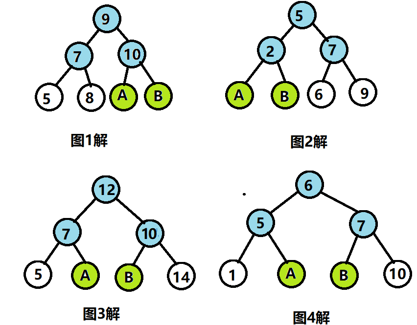

## AVL-Tree（平衡二叉树）

### 概念

​	之前已经说过，AVL是一颗平衡二叉搜索树，他是通过**平衡因子**这种机制来实现平衡的。

### 平衡因子

​	这个东西非常好理解，简单来说就是**左子树和右子树高度差**。我们认为什么样的树不平衡呢？就是**左子树和右子树高度差大于1**。

### 调整

​	也许在本科教学的时候，老师会讲授LL，LR，RL，RR四种旋转。这里我想提供一种新的思路，所以不讲这四种到底是怎么旋转的。主要来讲我这里提供的思路（其实也是从别大佬那里学来的）

​	我们知道二叉搜索树的中序遍历是有序的序列，所以说我们最理想的平衡情况就是，**这个中序遍历中间的结点成为根节点**。那事情就好办了，如果这里有一个树不是平衡的，例如：


这四棵树都是增加了A B两个节点之后整个树就不平衡了。所以我吗对于图1，写出没有AB时的中序遍历：5 **7** 8 **9** **10**；写出不平衡之后中序遍历：5 **7** 8 **9** A **10** B。我们到达A B必须经过 **7 9 10** 节点，按照刚刚“中间的节点作为中序遍历的根节点”的逻辑，我们应该选择 9 作为新的根节点。这样才是平衡的。所以：



这里调整的重点主要是**找到中序遍历的必经之路的中间结点**让这个中间结点作为根节点，其他结点按照BST的规则正常插入即可。

​	这里我们在仔细思考一下，为什么是必经之路的结点呢？ 实际上，你会发现所谓**不平衡就是在中序遍历中根节点过于偏左和偏右导致的**，所以你完全可以不去找那些什么必经之路的结点。只需要把不平衡树的中序遍历拿出来，把中间的结点当成新的根节点，其他的结点按照正常BST的规则插入就行了。同时这是思路也间接的的解决了删除导致不平衡的问题。

​	总结一下就是，这个调整思路和那四种旋转的着眼点是不同的：**本思路的着眼点在于不平衡树的中序遍历而四种旋转的着眼点在于不平衡的BST树本身**。其中前者是更加本质的原因。因为BST的产生就是我们希望可以通过中序遍历得到有序的序列，自然面对BST不平衡的情况对应到中序序列上就是：**我们的出发点不再是正中间而是在两边**从而导致我们的搜索效率下降。这和二分查找一个道理：1 2 3 4 5 6 7。我们想找5，但是我们没按照4作为分隔点而是选择1作为分隔点，自然和线性结构没有区别。

​	从实现的角度而言其实还是原来那样是分成左左，左右，右右，右左来实现，写代码的感觉就我而言和链表是很像的。

### 设计(C++)

​	其实当我一开始打算写AVL树的模板类，也是失败了很多次。现在回来总结一下我当时的错误并给出一个设计的方案：

​	我们给出两个类：BSTree 和 BSNode 分别表示AVL树和其结点。在BSTree中维护BSNode树形的结构。

​	在BSTNode中可以重载一些基本的算符(比如 < , >)作为比较器，方便日后结点之间直接比较。

​	在BSTree中，因为要做到两点 **：1.对外方便使用； 2.对内实现封装；**

​	具体的：

​		**对外(public)提供的接口：中序遍历，插入，删除；其中插入和删除，我们使用重载+=和-=算符的形式完成；**

​		**对内(private)提供的方法：求树的高度便于之后计算平衡因子，用于实现对外接口的一些含参的方法：插入，删除，销毁，遍历，搜索，求最值以及四种旋转。**

```C++
template <typename N>
struct BSTNode
{
	BSTNode<N> * lchild, *rchild;
	N data;
	int height;
	BSTNode(N value, BSTNode<N> * l, BSTNode<N> * r):data(value), rchild(r), lchild(l),height(0){}
	BSTNode<N> * operator>(BSTNode<N> * bst) { return this->data > bst->data ? this : bst; }
	BSTNode<N> * operator<(BSTNode<N> * bst) { return this->data < bst->data ? this : bst; }
	int return_height()const { return height; }
};
template <typename T>
class BSTree
{
	BSTNode<T> * root = nullptr;

	int height(BSTNode<T> * bst)const { if(bst != nullptr)		return bst->height; }
	void in_order(BSTNode<T> * bst)const;
	bool destroy(BSTNode<T> * & bst);//销毁树
		
	BSTNode<T> *insert(BSTNode<T> * &bst, T value);	 //插入值为value的结点
	BSTNode<T> * search(BSTNode<T> * bst, T value)const; //递归查找在bst中值为value的元素
	BSTNode<T> * remove(BSTNode<T> * & bst, BSTNode<T> * delete_bst);//从bst中删除delete_bst
	BSTNode<T> * minimum(BSTNode<T> * bst);//找到bst中最小的结点
	BSTNode<T> * maximum(BSTNode<T> * bst);//找到bst中最小的结点
	BSTNode<T> * left_left_rotation(BSTNode<T> * bst);
	BSTNode<T> * right_right_rotation(BSTNode<T> * bst);
	BSTNode<T> * left_right_rotation(BSTNode<T> * bst);
	BSTNode<T> * right_left_rotation(BSTNode<T> * bst);
	
public:
	BSTree():root(nullptr) {  }
	BSTree(T data) { root = new BSTNode<T>(data, nullptr, nullptr); }
	BSTree(T * array, int size);
	BSTree(const BSTree<T>& bst);//对于拷贝构造函数，可以实现；如果不是打算实现，请放入private中，防止编译器捣乱
	~BSTree() { destroy(root); }

	BSTNode<T> * operator+=(T value) { return insert(root, value); }
	BSTNode<T> * operator+=(BSTNode<T> bst) { return insert(root, bst->data); }
	BSTNode<T> * operator-=(T value);
	BSTNode<T> * operator-=(BSTNode<T> bst);
    int height() { return height(root); } 
//	int max(int a, int b) { return a > b ? a : b; }//返回大的值
	void in_order() { in_order(root); }
//	bool search(const T value);
	T maximum();
	T minimum();
};
```

